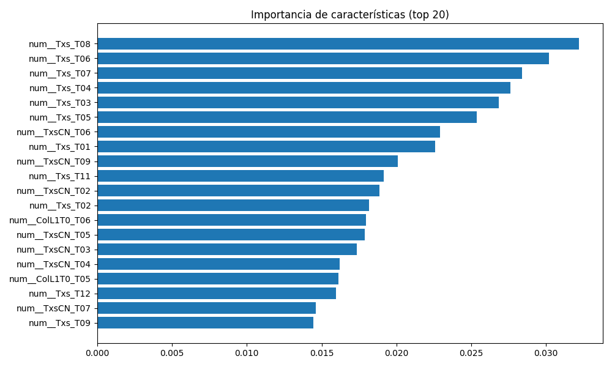
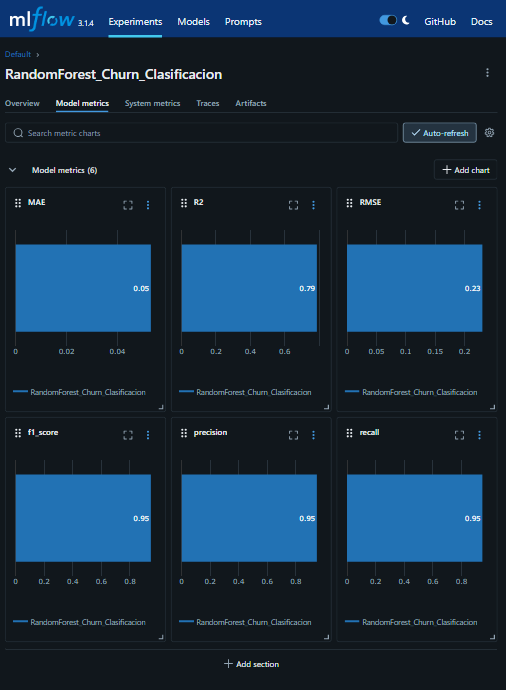
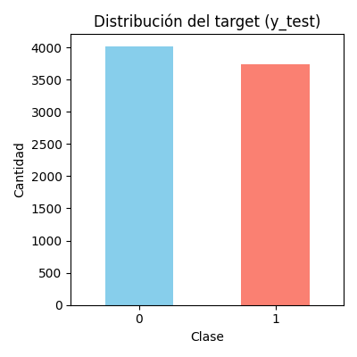

# 🧠 Predicción de Churn Bancario con MLflow y MLOps

Este proyecto implementa un flujo completo de machine learning aplicado a clientes bancarios, utilizando prácticas de MLOps. Se automatiza desde la carga y limpieza de datos hasta la ingeniería de características, entrenamiento del modelo, evaluación y trazabilidad con MLflow.

> 🔍 **Objetivo:** Predecir la retención o abandono de clientes bancarios a partir de comportamiento transaccional histórico y características demográficas.
---

## 🗂️ Estructura del Proyecto

```bash
churn-predictor-dormammu/
│
├── notebooks/                
│   └── demo.ipynb                  # Notebook de demostración (Jupyter)
│
├── src/                            # Código fuente modular
│   ├── load_data.py
│   ├── preprocessing.py
│   ├── feature_engineering.py
│   ├── model_training.py
│   ├── evaluation.py
│   └── utils/
│       └── column_analysis.py
│
├── models/                         # Modelos entrenados (si se activa --backup)
│
├── images/                         # Gráficos para README o notebook
│
├── requirements.txt
├── README.md
├── .gitignore
└── main.py                         # Punto de entrada de la pipeline
````

---
## 📊 Dataset Utilizado

* 📦 Fuente: [Kaggle - Base Clientes Monopoly](https://www.kaggle.com/datasets/nadiaarellanog/base-clientes-monopoly)
* 👥 450.000+ clientes bancarios
* 📅 Variables temporales mensuales (últimos 12 meses)
* 🔢 Variables de uso, facturación, pagos, cobranza, etc.
* 🎯 Target generado: `target_binario` (0 = Retención, 1 = Abandono)

---
## ⚙️ Tecnologías utilizadas

    
   ![Joblib](https://img.shields.io/badge/-Joblib-FFFFFF?style=for-the-badge&logo=data:image/svg+xml;base64,PD94bWwgdmVyc2lvbj0iMS4wIiBlbmNvZGluZz0iVVRGLTgiIHN0YW5kYWxvbmU9Im5vIj8+CjwhLS0gQ3JlYXRlZCB3aXRoIElua3NjYXBlIChodHRwOi8vd3d3Lmlua3NjYXBlLm9yZy8pIC0tPgoKPHN2ZwogICB4bWxuczpkYz0iaHR0cDovL3B1cmwub3JnL2RjL2VsZW1lbnRzLzEuMS8iCiAgIHhtbG5zOmNjPSJodHRwOi8vY3JlYXRpdmVjb21tb25zLm9yZy9ucyMiCiAgIHhtbG5zOnJkZj0iaHR0cDovL3d3dy53My5vcmcvMTk5OS8wMi8yMi1yZGYtc3ludGF4LW5zIyIKICAgeG1sbnM6c3ZnPSJodHRwOi8vd3d3LnczLm9yZy8yMDAwL3N2ZyIKICAgeG1sbnM9Imh0dHA6Ly93d3cudzMub3JnLzIwMDAvc3ZnIgogICB4bWxuczpzb2RpcG9kaT0iaHR0cDovL3NvZGlwb2RpLnNvdXJjZWZvcmdlLm5ldC9EVEQvc29kaXBvZGktMC5kdGQiCiAgIHhtbG5zOmlua3NjYXBlPSJodHRwOi8vd3d3Lmlua3NjYXBlLm9yZy9uYW1lc3BhY2VzL2lua3NjYXBlIgogICBpZD0ic3ZnMiIKICAgdmVyc2lvbj0iMS4xIgogICBpbmtzY2FwZTp2ZXJzaW9uPSIwLjkxIHIxMzcyNSIKICAgd2lkdGg9Ijg2Mi40NzkxMyIKICAgaGVpZ2h0PSI3OTQuOTIwNzIiCiAgIHNvZGlwb2RpOmRvY25hbWU9ImpvYmxpYl9sb2dvLnN2ZyI+CiAgPG1ldGFkYXRhCiAgICAgaWQ9Im1ldGFkYXRhOCI+CiAgICA8cmRmOlJERj4KICAgICAgPGNjOldvcmsKICAgICAgICAgcmRmOmFib3V0PSIiPgogICAgICAgIDxkYzpmb3JtYXQ+aW1hZ2Uvc3ZnK3htbDwvZGM6Zm9ybWF0PgogICAgICAgIDxkYzp0eXBlCiAgICAgICAgICAgcmRmOnJlc291cmNlPSJodHRwOi8vcHVybC5vcmcvZGMvZGNtaXR5cGUvU3RpbGxJbWFnZSIgLz4KICAgICAgICA8ZGM6dGl0bGUgLz4KICAgICAgPC9jYzpXb3JrPgogICAgPC9yZGY6UkRGPgogIDwvbWV0YWRhdGE+CiAgPGRlZnMKICAgICBpZD0iZGVmczYiLz4KICA8c29kaXBvZGk6bmFtZWR2aWV3CiAgICAgcGFnZWNvbG9yPSIjZmZmZmZmIgogICAgIGJvcmRlcmNvbG9yPSIjNjY2NjY2IgogICAgIGJvcmRlcm9wYWNpdHk9IjEiCiAgICAgb2JqZWN0dG9sZXJhbmNlPSIxMCIKICAgICBncmlkdG9sZXJhbmNlPSIxMCIKICAgICBndWlkZXRvbGVyYW5jZT0iMTAiCiAgICAgaW5rc2NhcGU6cGFnZW9wYWNpdHk9IjEiCiAgICAgaW5rc2NhcGU6cGFnZXNoYWRvdz0iMiIKICAgICBpbmtzY2FwZTp3aW5kb3ctd2lkdGg9IjEzNzUiCiAgICAgaW5rc2NhcGU6d2luZG93LWhlaWdodD0iODc2IgogICAgIGlkPSJuYW1lZHZpZXc0IgogICAgIHNob3dncmlkPSJmYWxzZSIKICAgICBpbmtzY2FwZTp6b29tPSIwLjQwNjA2Mzk5IgogICAgIGlua3NjYXBlOmN4PSIyODMuMTg0NzciCiAgICAgaW5rc2NhcGU6Y3k9IjIyMS45OTQyOSIKICAgICBpbmtzY2FwZTp3aW5kb3cteD0iNjUiCiAgICAgaW5rc2NhcGU6d2luZG93LXk9IjI0IgogICAgIGlua3NjYXBlOndpbmRvdy1tYXhpbWl6ZWQ9IjEiCiAgICAgaW5rc2NhcGU6Y3VycmVudC1sYXllcj0iZzQ1NDciCiAgICAgZml0LW1hcmdpbi10b3A9IjAiCiAgICAgZml0LW1hcmdpbi1sZWZ0PSIwIgogICAgIGZpdC1tYXJnaW4tcmlnaHQ9IjAiCiAgICAgZml0LW1hcmdpbi1ib3R0b209IjAiIC8+CiAgPHBhdGgKICAgICBpZD0icGF0aDQ1MTEiCiAgICAgc3R5bGU9ImZpbGw6I2UxNTYxNztmaWxsLW9wYWNpdHk6MSIKICAgICBkPSJtIDE3OS40ODcxMSw3MDQuNTEzMTUgYyAyNS42NzMxLC02LjY4NyA0NS41MTEwNiwtMjQuOTcwNjcgNTMuMTMyLC00OC45NjkxNSAxMi44MzM0OCwtNDAuNDEyODggLTguOTg3OTksLTgyLjA2Nzc3IC00OS41OTQ1NiwtOTQuNjcwODIgLTYuNDE2MTIsLTEuOTkxMzcgLTkuNTIzMjQsLTIuMzE3MTQgLTIxLjUsLTIuMjU0MjMgLTEyLjUxNzY5LDAuMDY1OCAtMTQuODQ3MDMsMC4zNjI3NCAtMjIsMi44MDQ4OSAtNC40LDEuNTAyMjUgLTExLjE1LDQuNTc1ODkgLTE1LDYuODMwMzIgLTguMzU1NjEsNC44OTI3NyAtMjEuNTk1MzMsMTcuOTgyMDUgLTI2LjM2NTI1NiwyNi4wNjU2OSAtOS4zNDkwMiwxNS44NDM4MiAtMTIuNjEwMzU4LDM3LjQ4NDY5IC04LjI1MTEwNSw1NC43NTA4IDcuNzY0ODIzLDMwLjc1NDg5IDMxLjIxMTE5MSw1Mi4xMTk0NiA2Mi41OTI5MTEsNTcuMDM1MzEgNi4yNjcxOCwwLjk4MTczIDIwLjI3NjIyLDAuMTU0ODcgMjYuOTg2MDEsLTEuNTkyODEgeiBtIC03OC45NjI1Niw4NC42NTk2NiAtMTUuOTk5OTk2LC02LjY1OTU4IDAuMDQwMywtNS40ODM5MSBjIDAuMDIyMTcsLTMuMDE2MTUgMC40MTc4NjQsLTEyLjY5Nzc0IDAuODc5MzI4LC0yMS41MTQ2NCBsIDAuODM5MDI2LC0xNi4wMzA3NCAtNi45NjI0NjUsLTUuNjk2MjEgYyAtNi45ODI0NCwtNS43MTI1NSAtMTQuMDk5ODMyLC0xMi44NzkzMiAtMTkuOTgwODgsLTIwLjExOTUgbCAtMy4xNDkzNTEsLTMuODc3MTcgLTIwLjE0NjU4NywxLjI3Nzg1IGMgLTE3LjE2Njg4OSwxLjA4ODg2IC0yMC4zMzgwNDcsMS4wNzA3IC0yMS40NDExMDgsLTAuMTIyODIgQyAxMi42NjczNjUsNzA4Ljg1MTkyIDEuODQxNDIzNCw2ODAuOTY1MDIgMi4zOTk0MTAxLDY3OS41MTA5MyAyLjY2NDc5NjUsNjc4LjgxOTM1IDkuMzU4NjcyOCw2NzIuNzkzMjIgMTcuMjc0NjkxLDY2Ni4xMTk1NCBMIDMxLjY2NzQ1MSw2NTMuOTg1NTcgMzEuNDk4OTY0LDYzMy43NjU0OSAzMS4zMzA0NzgsNjEzLjU0NTQxIDE2LjIxMzA4Nyw2MDAuNTMwOTggQyA3Ljg5ODUyMjIsNTkzLjM3MzA1IDAuNjM1MDM1OTIsNTg3LjA1NTg5IDAuMDcyMDA2NDIsNTg2LjQ5Mjg2IC0wLjk4ODg5OTg3LDU4NS40MzE5NiA5Ljk4NTMxNjgsNTU2Ljg1MDU0IDEyLjQ0OTY3OSw1NTQuMjU2MjcgYyAwLjk5OTQyMSwtMS4wNTIxMSA0Ljk4MDE0LC0xLjA0MjU1IDIxLjY0OTczLDAuMDUyIGwgMjAuNDI1MTQ1LDEuMzQxMDcgMywtMy4wNzc4NiBjIDEuNjUsLTEuNjkyODIgNS43LC02LjAxNzMxIDksLTkuNjA5OTcgMy4zLC0zLjU5MjY2IDguNjU0NjY4LC04LjgxMTEyIDExLjg5OTI2MiwtMTEuNTk2NTcgbCA1Ljg5OTI2MiwtNS4wNjQ0NiAtMS4zMTg2MTcsLTIyLjIxMzg1IGMgLTEuMTM0MzkxLC0xOS4xMTAzMiAtMS4xMjAzMTYsLTIyLjMzODkyIDAuMTAwNzM4LC0yMy4xMDkwNSAzLjQzODk0OSwtMi4xNjg5OCAyOS4zNTYyNTEsLTEyLjAwNjYgMzAuOTEzNzUxLC0xMS43MzQxNyAwLjk0OTU4LDAuMTY2MSA3LjkxMzM2LDcuNjAzODYgMTUuNDc1MDcsMTYuNTI4MzUgbCAxMy43NDg1NSwxNi4yMjYzNCAxMy42NDA5OSwtMC41NzU0OCBjIDcuNTAyNTQsLTAuMzE2NTEgMTYuMzQwOTksLTAuMTI4NjQgMTkuNjQwOTksMC40MTc0OSAzLjMsMC41NDYxMyA2LjY3NSwwLjYxNjc1IDcuNSwwLjE1NjkzIDAuODI1LC0wLjQ1OTgyIDcuMTI1LC03LjU3NzEzIDE0LC0xNS44MTYyNSA2Ljg3NSwtOC4yMzkxMiAxMy4wNzczNywtMTUuMjMxNzEgMTMuNzgzMDQsLTE1LjUzOTA5IDEuMjAzMzgsLTAuNTI0MTggMzAuODEzOTIsMTAuNjg5NTUgMzIuNDg5MDYsMTIuMzAzODUgMC40MjQ2NiwwLjQwOTIzIDAuMTAwODksMTAuNjA2ODcgLTAuNzE5NDgsMjIuNjYxNDIgbCAtMS40OTE1OCwyMS45MTczNSA5LjI1NzA1LDkuMDEwNTUgYyA1LjA5MTM4LDQuOTU1NzkgMTEuMjg0ODUsMTEuMzU5ODEgMTMuNzYzMjcsMTQuMjMxMTMgNC4wOTkzMiw0Ljc0OTE4IDQuODE4MzIsNS4xODA0NiA3Ljk2MjQzLDQuNzc2MDkgNy4zMzI2NCwtMC45NDMwNiAzOS44OTM5MSwtMi42NTMyMSA0MC43MjU5NywtMi4xMzg5OCAwLjQ4MjE3LDAuMjk4IDMuNzM2NzMsNy41OTk4NCA3LjIzMjM0LDE2LjIyNjMgbCA2LjM1NTY3LDE1LjY4NDQ5IC00LjQzNzE2LDQuMTE1NzUgYyAtMi40NDA0NCwyLjI2MzY3IC0xMC4xMzM0NCw4LjkzMTc0IC0xNy4wOTU1NSwxNC44MTc5NCBsIC0xMi42NTgzOSwxMC43MDIxNyAtMC4zNjc1MywxNy43OTc4MyBjIC0wLjIwMjE1LDkuNzg4OCAtMC4xMjcxNSwxOC4zMDAwMSAwLjE2NjY2LDE4LjkxMzc5IDAuMjkzODEsMC42MTM3OCA3LjI4NDIsNi44MzQ3OCAxNS41MzQyLDEzLjgyNDQ0IDguMjUsNi45ODk2NiAxNS4yOTk0LDEzLjI0MTkzIDE1LjY2NTMyLDEzLjg5MzkzIDAuNTk5MzksMS4wNjc5NyAtMTAuODE0MjksMzAuNjQ3OTYgLTEyLjQ2MTI1LDMyLjI5NDkyIC0wLjM3NjI0LDAuMzc2MjQgLTEwLjA1MDA3LDAuMTA5MzkgLTIxLjQ5NzQsLTAuNTkyOTkgbCAtMjAuODEzMzMsLTEuMjc3MDcgLTE0LjcyNjgsMTQuNzI2OCAtMTQuNzI2OCwxNC43MjY4IDEuMTIwMTYsMTcuMTQzNiBjIDAuNjE2MDgsOS40Mjg5OCAwLjk2NzE0LDE4LjkyMjIgMC43ODAxMywyMS4wOTYwNSBsIC0wLjM0MDAzLDMuOTUyNDQgLTE1LjQ2NjE3LDYuMTgzMjIgYyAtOC41MDY0LDMuNDAwNzcgLTE1LjkzMTQsNS45NzgwNyAtMTYuNSw1LjcyNzM0IC0wLjU2ODYxLC0wLjI1MDczIC02Ljc4MTYxLC03LjI4Njc4IC0xMy44MDY2NywtMTUuNjM1NjYgbCAtMTIuNzcyODQsLTE1LjE3OTc5IC0xOS4yMDg2NywwLjI2NzIzIGMgLTEzLjY1NTcsMC4xODk5NyAtMTkuNTMyNSwwLjYyMzYgLTIwLjMyODgzLDEuNSAtMC42MTYwOSwwLjY3ODAyIC02LjQzMzA1LDcuNTMyNzcgLTEyLjkyNjU3LDE1LjIzMjc3IC02LjQ5MzUzLDcuNyAtMTIuMjk3NzcsMTQuNTE0NTcgLTEyLjg5ODMzLDE1LjE0MzQ4IC0wLjgxMjIxLDAuODUwNTYgLTUuMTkwNTgsLTAuNTYyNDcgLTE3LjA5MTkyLC01LjUxNjA4IHoiCiAgICAgaW5rc2NhcGU6Y29ubmVjdG9yLWN1cnZhdHVyZT0iMCIgLz4KICA8cGF0aAogICAgIGlkPSJwYXRoMjk4NyIKICAgICBzdHlsZT0iZmlsbDojMDAwMDAwO2ZpbGwtb3BhY2l0eToxIgogICAgIGQ9Im0gNDY3LjY1NDI2LDYzNC44MTg4NiBjIC0wLjc5NTkzLC0xLjI1MDQgLTMuOTg4MjIsLTEwLjE0ODQ1IC03LjA5Mzk5LC0xOS43NzM0NSAtMy4xMDU3NywtOS42MjUgLTYuMTg0MzUsLTE4LjAyMDE1IC02Ljg0MTI5LC0xOC42NTU4OSAtMC42NTY5NCwtMC42MzU3NCAtNi4xNDQ0MywtMS45MDc1NiAtMTIuMTk0NDMsLTIuODI2MjUgLTYuMDUsLTAuOTE4NyAtMTUuMzkxNCwtMi43NDU0MyAtMjAuNzU4NjcsLTQuMDU5NCAtNS4zNjcyNywtMS4zMTM5NyAtMTAuMzE3MjcsLTIuMTUxNzcgLTExLC0xLjg2MTc3IC0wLjY4MjczLDAuMjg5OTkgLTcuMDkxMzMsNy41MTQ4OCAtMTQuMjQxMzMsMTYuMDU1MyAtNy4xNSw4LjU0MDQyIC0xMy4zNTg3NywxNS43NTIyNCAtMTMuNzk3MjcsMTYuMDI2MjYgLTEuMzI1OTgsMC44Mjg2IC0zMS44Mjk3NCwtMTEuODQ1NjUgLTMyLjQ1OTU0LC0xMy40ODY4OCAtMC4zMjE5NywtMC44MzkwNiAtMC4wMTM3LC0xMC43Nzk5MSAwLjY4NDk2LC0yMi4wOTA3NyAxLjIxNDczLC0xOS42NjQ2NiAxLjE4OTM4LC0yMC42MjI2NyAtMC41Nzg4OSwtMjEuODc3MTMgLTEuMDE3MDksLTAuNzIxNTUgLTYuMzQ5MjYsLTQuMDc1NjggLTExLjg0OTI2LC03LjQ1MzYyIC01LjUsLTMuMzc3OTUgLTEzLjg4ODQ1LC04Ljk4MzA1IC0xOC42NDEsLTEyLjQ1NTc4IC00Ljc1MjU1LC0zLjQ3Mjc0IC05LjM3MDM1LC02LjMxNDA3IC0xMC4yNjE3NiwtNi4zMTQwNyAtMC44OTE0MiwwIC04LjgxMDE4LDMuNiAtMTcuNTk3MjQsOCAtOC43ODcwNiw0LjQgLTE2LjU1MTMsOCAtMTcuMjUzODcsOCAtMS42NDU4OSwwIC0yNC43NDYxMywtMjMuMTI4MjQgLTI0Ljc0NjEzLC0yNC43NzYxMyAwLC0wLjY4NTM1IDMuODQyNDIsLTguOTIwODkgOC41Mzg3MiwtMTguMzAxMiBsIDguNTM4NzEsLTE3LjA1NTEyIC01LjM5OTUxLC03LjE4Mzc4IGMgLTYuNTMwOTgsLTguNjg5MTIgLTE2LjYzNzUsLTI0LjAwMTUyIC0yMC4zODAwNiwtMzAuODc3ODMgbCAtMi43MzU0MSwtNS4wMjU4NiAtMTQuNTMxMjMsMC44NDI0NyBjIC03Ljk5MjE3LDAuNDYzMzYgLTE3LjQ1NjIyLDAuODUwMzQgLTIxLjAzMTIyLDAuODU5OTYgbCAtNi41LDAuMDE3NSAtNi4xNjkxMiwtMTUgYyAtMy4zOTMwMSwtOC4yNSAtNi4yMDU1MSwtMTUuNTQ4MjggLTYuMjUsLTE2LjIxODM5IC0wLjA0NDUsLTAuNjcwMTIgNi4xMDY2MiwtNi40NzcxIDEzLjY2OTEyLC0xMi45MDQ0IDcuNTYyNSwtNi40MjczIDE0LjU4NDMsLTEyLjQ2MzMyIDE1LjYwNCwtMTMuNDEzMzggMS44MDI4NywtMS42Nzk3NSAxLjc4MjIzLC0yLjA0MDk0IC0wLjc0ODI4LC0xMy4wOTU2MSAtMS40MzEyNSwtNi4yNTI1MyAtMy4zMDU2NywtMTUuODY4MjMgLTQuMTY1MzcsLTIxLjM2ODIzIC0wLjg1OTcsLTUuNSAtMi4wMDczNiwtMTAuNDUgLTIuNTUwMzUsLTExIC0wLjU0MywtMC41NSAtOS42Mjc4OSwtMy45MjUgLTIwLjE4ODY0LC03LjUgbCAtMTkuMjAxMzYsLTYuNSB2IC0xNy45MTY0NiAtMTcuOTE2NDcgbCAyMCwtNi42NjYyNCAyMCwtNi42NjYyNCAyLjA5ODc3LC0xMi40MTczIGMgMS4xNTQzMywtNi44Mjk1MSAzLjA2NjgzLC0xNi42MTM3OCA0LjI1LC0yMS43NDI4MiAxLjE4MzE4LC01LjEyOTA0IDIuMTUxMjMsLTkuOTMyNTMgMi4xNTEyMywtMTAuNjc0NDIgMCwtMC43NDE4OSAtNi45NzUsLTcuMjgxMjcgLTE1LjUsLTE0LjUzMTk2IC04LjUyNSwtNy4yNTA2OCAtMTUuNDg4LC0xMy42OTcxOSAtMTUuNDczMzQsLTE0LjMyNTU3IDAuMDE0NywtMC42MjgzOSAyLjgzMzkyLC03Ljg5MjUyIDYuMjY1MDIsLTE2LjE0MjUyIGwgNi4yMzgzNiwtMTUgNy45ODQ5OCwwLjAwNiBjIDQuMzkxNzQsMC4wMDMgMTQuMDMyODIsMC4yMjgxNiAyMS40MjQ2MiwwLjUgbCAxMy40Mzk2NSwwLjQ5NCA2LjQyOTc2LC0xMC41IGMgMy41MzYzNiwtNS43NzUgOS4xODg1MiwtMTQuMjU4MzEgMTIuNTYwMzUsLTE4Ljg1MTgxIDMuMzcxODMsLTQuNTkzNDkgNi43MTgxMiwtOS4xNjEwMSA3LjQzNjIsLTEwLjE1MDA0IDEuMTM3MzEsLTEuNTY2NDQgMC4yMDI3MywtNC4wMDExMSAtNy4yNSwtMTguODg3MDkgLTQuNzA1NTgsLTkuMzk4ODYgLTguNTU1NiwtMTcuNjQ5NTggLTguNTU1NiwtMTguMzM0OTMgMCwtMS42NDc0OSAyMy4xMDAwMywtMjQuNzc2MTMgMjQuNzQ1NDgsLTI0Ljc3NjEzIDAuNzAyMiwwIDguOTY2NzIsMy44NTAwMiAxOC4zNjU1OCw4LjU1NTYgMTQuODYwNDQsNy40Mzk5NCAxNy4zMjExMiw4LjM4NTM2IDE4Ljg3MDAxLDcuMjUgMTQuNDEzODksLTEwLjU2NTQ3IDIzLjIwMzQ5LC0xNi41NTgwNyAzMS4yNjg5MywtMjEuMzE4NTkgbCA5Ljc1LC01Ljc1NDgxIC0wLjAwOSwtNS42MTYxIGMgLTAuMDA1LC0zLjA4ODg2IC0wLjQ2MTM2LC0xMS44OTM0OSAtMS4wMTQ1MiwtMTkuNTY1ODYgLTAuNzkyOTEsLTExLjAwMDc0IC0wLjczODIsLTE0LjE5Mjk4IDAuMjU5LC0xNS4xMDAyNCAxLjc0OTU0LC0xLjU5MTc1IDI4LjU5NDIzLC0xMi40NSAzMC43Nzk5NCwtMTIuNDUgMS4wNTc4LDAgNi43Mzk0Myw1Ljg5NTU3IDE0LjA1OTA5LDE0LjU4ODQ5IDE0LjA3MjUxLDE2LjcxMjY4IDEwLjYxMDE2LDE1LjQyNjk0IDI5LjkyNTQ5LDExLjExMjc5IDYuMzI1LC0xLjQxMjcxIDE1LjMyMjk3LC0zLjA4NTAxIDE5Ljk5NTQ4LC0zLjcxNjIxIDQuNjcyNTIsLTAuNjMxMjEgOS4wMzM3NCwtMS41OTQzNiA5LjY5MTYxLC0yLjE0MDM0IDAuNjU3ODYsLTAuNTQ1OTggMy43MzgxOCwtOC42MTk2MiA2Ljg0NTE0LC0xNy45NDE0MiBMIDQ2OC4yMDU3OSwwIGwgMTcuNTc2NjgsMC4yNzI3MSAxNy41NzY2NywwLjI3MjcgNS41ODI3MSwxNi41MjI4OCBjIDMuMDcwNDgsOS4wODc1OCA1LjkyNzI5LDE3LjA0MzU4IDYuMzQ4NDYsMTcuNjgwMDEgMC40MjExNywwLjYzNjQyIDMuMzQ2MTcsMS40NTg4OSA2LjUsMS44Mjc3IDcuNDUwNzQsMC44NzEyOCAzNC41Mjc5MSw2LjI1MDM3IDM3Ljg4MTczLDcuNTI1NDggMy4yODc1OCwxLjI0OTk0IDMuMDk1NjUsMS40MTQ5MyAxNi4wMDE2LC0xMy43NTQ0NSA1Ljc1NjM1LC02Ljc2NTg5IDExLjA4MDI2LC0xMi4zMDE2MiAxMS44MzA5LC0xMi4zMDE2MiAwLjc1MDY0LDAgOC4xNDk3MiwyLjc1OTQgMTYuNDQyNCw2LjEzMjAxIGwgMTUuMDc3NjEsNi4xMzIgLTAuMTAwMjEsNy42MTggYyAtMC4wNTUxLDQuMTg5ODkgLTAuMzkyNjIsMTIuMDk0NjYgLTAuNzUsMTcuNTY2MTYgLTAuNTI5NTIsOC4xMDY4MyAtMC4zNzIxNSwxMC4yNDk2NCAwLjg1MDIxLDExLjU3Njk0IDAuODI1LDAuODk1ODMgNi4yNTQ3Miw0LjQ0MjI3IDEyLjA2NjA0LDcuODgwOTggNS44MTEzMywzLjQzODcxIDE1LjE3MDU4LDkuNjQxMjUgMjAuNzk4MzUsMTMuNzgzNDMgbCAxMC4yMzIzLDcuNTMxMjQgMTYuODU3ODQsLTguNjEwMzggYyA5LjI3MTgyLC00LjczNTcxIDE3LjQ2OTYsLTguNjEwMzggMTguMjE3MjksLTguNjEwMzggMS43MDI0OSwwIDI0LjgyODE4LDIzLjA3NzgxIDI0LjgyODE4LDI0Ljc3Njc4IDAsMC42ODU3MSAtMy42LDguNDM2MTYgLTgsMTcuMjIzMjIgLTQuNCw4Ljc4NzA2IC04LDE2Ljg0NzI0IC04LDE3LjkxMTUxIDAsMS4wNjQyNyAxLjA2MjQxLDMuMjA3MDcgMi4zNjA5Miw0Ljc2MTc2IDMuNzE5NTksNC40NTM0OCAxNi44OTUyNCwyNC4xMzM3NSAyMS4yMTUyOCwzMS42ODg5NSBsIDMuOTIzOCw2Ljg2MjIzIDE1LjUsLTAuODA3NjggYyA4LjUyNSwtMC40NDQyMiAxNy4yOTg4NiwtMC44MzIyMiAxOS40OTc0NiwtMC44NjIyMiBsIDMuOTk3NDYsLTAuMDU0NiA2LjE3MTY1LDE1IGMgMy4zOTQ0Miw4LjI1IDYuMjA4MDYsMTUuNjgyNDIgNi4yNTI1NSwxNi41MTY0OSAwLjA0NDUsMC44MzQwNyAtNi4yMTkxMiw2LjgzNzggLTEzLjkxOTEyLDEzLjM0MTYxIC04LjY2NjgxLDcuMzIwNDQgLTE0LDEyLjUyNzg0IC0xNCwxMy42Njk4MSAwLDEuMDE0NTcgMS4xMTI3OSw2LjQ0MDM4IDIuNDcyODcsMTIuMDU3MzUgMS4zNjAwOCw1LjYxNjk3IDMuMTg5NSwxNS4yMDgxNCA0LjA2NTM5LDIxLjMxMzcxIDAuODc1ODksNi4xMDU1NiAxLjkzMjY0LDExLjc0OTA5IDIuMzQ4MzUsMTIuNTQxMTYgMC40MTU3MSwwLjc5MjA3IDguMzczNzgsMy45NzkzMSAxNy42ODQ2MSw3LjA4Mjc0IGwgMTYuOTI4NzgsNS42NDI2MiAwLjI3MTY1LDE3LjkzMTQ3IDAuMjcxNjQsMTcuOTMxNDggLTE3LjUyMDc5LDUuODA4MjkgYyAtMTQuNzkyMzcsNC45MDM3OSAtMTcuNTk0MjMsNi4xNDczOCAtMTcuOTkyMzUsNy45ODU3OCAtMC4yNTkzNSwxLjE5NzYyIC0xLjM3OTAyLDcuNzEyNzIgLTIuNDg4MTQsMTQuNDc4MDEgLTEuMTA5MTMsNi43NjUyOCAtMi45MjIzMiwxNS45Mzk2IC00LjAyOTMsMjAuMzg3MzggLTEuMTA2OTksNC40NDc3NyAtMi4wMTI3MSw4LjU5ODggLTIuMDEyNzEsOS4yMjQ1IDAsMC42MjU3MSA2LjMsNi40NjcyIDE0LDEyLjk4MTEgNy43LDYuNTEzOSAxNC4wMDUxOCwxMi4zNTI2NCAxNC4wMTE1MSwxMi45NzQ5OCAwLjAyMTgsMi4xNDgxOCAtMTIuMzYzNDMsMzEuNTUyNDEgLTEzLjQzNjAxLDMxLjg5ODc5IC0wLjU5MTUyLDAuMTkxMDMgLTguNzI1NSwtMC4xNTc2OCAtMTguMDc1NSwtMC43NzQ5MSAtOS4zNSwtMC42MTcyMyAtMTcuNTQzMjgsLTAuOTM5NzQgLTE4LjIwNzMsLTAuNzE2NyAtMC42NjQwMSwwLjIyMzA1IC00LjIwOTI0LDUuNDI3MjcgLTcuODc4MjksMTEuNTY0OTQgLTMuNjY5MDUsNi4xMzc2NyAtOS45ODgyNiwxNS43MzIxOCAtMTQuMDQyNywyMS4zMjExNCAtNC4wNTQ0NCw1LjU4OTAxIC03LjM3MTcxLDEwLjg4MTggLTcuMzcxNzEsMTEuNzYxODEgMCwwLjg4MDAxIDMuNiw4Ljc4OTQ0IDgsMTcuNTc2NSA0LjQsOC43ODcwNiA4LDE2Ljc3NjYxIDgsMTcuNzU0NTUgMCwyLjI5NjUyIC0yMS45Nzc4NiwyNC4yNDU0NSAtMjQuMjc3NDEsMjQuMjQ1NDUgLTAuOTYwMzYsMCAtOC45MzU1MywtMy42IC0xNy43MjI1OSwtOCAtOC43ODcwNiwtNC40IC0xNi42ODU2NCwtOCAtMTcuNTUyMzksLTggLTAuODY2NzQsMCAtNi41NDY5NywzLjU5NzM2IC0xMi42MjI3MSw3Ljk5NDEyIC02LjA3NTc0LDQuMzk2NzcgLTE1LjAzMDIyLDEwLjI5MzA5IC0xOS44OTg4MywxMy4xMDI5MyAtNC44Njg2MiwyLjgwOTg1IC05LjM3NzY4LDUuNzQyMTggLTEwLjAyMDE1LDYuNTE2MyAtMC44OTExNSwxLjA3Mzc4IC0wLjg3OTI4LDUuOTM2NzMgMC4wNTAxLDIwLjUxIDAuNjY5OTksMTAuNTA2MzggMC44NDE0OCwxOS40MzY5NyAwLjM4MTA5LDE5Ljg0NTc1IC0wLjgzMzUyLDAuNzQwMDYgLTMwLjcyNjY5LDEzLjAzMDkgLTMxLjY5MzE1LDEzLjAzMDkgLTAuMjc5MTEsMCAtNi4yMzg0NywtNi43NSAtMTMuMjQzMDIsLTE1IC03LjAwNDU0LC04LjI1IC0xMy4yNjgyMSwtMTUgLTEzLjkxOTI3LC0xNSAtMC42NTEwNSwwIC01LjYzODI3LDEuMDkwNjkgLTExLjA4MjcsMi40MjM3NSAtNS40NDQ0MywxLjMzMzA2IC0xNC44NDg5NywzLjE3NzU5IC0yMC44OTg5Nyw0LjA5ODk0IC02LjA1LDAuOTIxMzYgLTExLjQ1LDIuMDk5NDcgLTEyLDIuNjE4MDIgLTAuNTUsMC41MTg1NSAtMy45NjIxNiw5LjgxMTUzIC03LjU4MjU4LDIwLjY1MTA2IGwgLTYuNTgyNTksMTkuNzA4MjMgLTE3LjEyOSwwLjI3MzQ1IGMgLTE2Ljg2NTYxLDAuMjY5MjQgLTE3LjE1MTI1LDAuMjM4NDkgLTE4LjU3NjEyLC0yIHogbSA1Mi44OTY1NiwtMTc2LjMxMTAxIGMgNS44NTg1LC0xLjU2MTc0IDE3Ljg0MTgsLTYuMzk2MDcgMjYuNjI5NTYsLTEwLjc0Mjk3IDM2LjI5NjA5LC0xNy45NTQwNCA2MS4wMTcwMiwtNDYuNzk1MDYgNzQuMjE4MjgsLTg2LjU4Nzc5IDQuOTM5NTcsLTE0Ljg4OTM2IDUuNDEwNjUsLTE4LjM5MDAxIDUuNTM0NzQsLTQxLjEyODgyIDAuMTE0MTYsLTIwLjkxNjc1IC0wLjUxMTg1LC0yNy4xMDQyNSAtMy45NTE1MiwtMzkuMDU2NjggLTExLjkyODU1LC00MS40NTAzNyAtMzkuODI0NjEsLTc0LjY4Njc3IC03Ny41NzY4MSwtOTIuNDI3OTIgLTIzLjIxMzM0LC0xMC45MDg4IC0zNi43NTk0MiwtMTMuOTM3MyAtNjIuMTM1NjMsLTEzLjg5MTY4IC0yMi40Nzc3MywwLjA0MDUgLTM0LjgzODEsMi4zNzcxMyAtNTQuNDI2OSwxMC4yODk0IC0xOC4zNzY2OCw3LjQyMjY4IC0zMC4zNTM3NSwxNS43MDEzOSAtNDcuNzQ2MDEsMzMuMDAyNjcgLTE1LjAxNjc5LDE0LjkzODI0IC0xNy45OTk0OSwxOS4wMDM3NyAtMjYuMDUyMzQsMzUuNTEwMzIgLTEyLjQzNzY5LDI1LjQ5NDQzIC0xNS40MzU2NSwzOC4yODQwNSAtMTUuMzk3MjEsNjUuNjg2MjQgMC4wMjQzLDE3LjM2NDE4IDAuODczODYsMjUuMTc1NjkgMy45MDUzNSwzNS45MTExOSAxNS41NzYzLDU1LjE2MDUyIDYwLjAxMTA5LDk2LjA3Mjk2IDExNS4zMTM5MiwxMDYuMTcyOTkgMTIuMTc1MzYsMi4yMjM1OCA0OS4yNDYzNSwwLjU3ODc1IDYxLjY4NDU3LC0yLjczNjk1IHoiCiAgICAgaW5rc2NhcGU6Y29ubmVjdG9yLWN1cnZhdHVyZT0iMCIgLz4KPC9zdmc+Cg==)


[//]: # "- Python 3.10+"
[//]: # "- Jupyter"
[//]: # "- pandas, numpy"
[//]: # "- scikit-learn"
[//]: # "- mlflow"
[//]: # "- joblib"
[//]: # "- matplotlib, seaborn"

---

## 🚀 Ejecución del Proyecto

### 1. Clonar el repositorio

```bash
git clone https://github.com/alex-msu/churn-predictor-dormammu.git
cd churn-predictor-dormammu
```

### 2. Crear entorno virtual (opcional pero recomendado)

```bash
python -m venv venv
source venv/bin/activate      # Linux/Mac
venv\Scripts\activate         # Windows
```

### 3. Instalar dependencias

```bash
pip install -r requirements.txt
```

### 4. Iniciar el servidor local de MLflow (seguimiento de experimentos)

```bash
mlflow server ^
  --backend-store-uri sqlite:///mlflow.db ^
  --default-artifact-root file:///C:/Users/TU_USUARIO/churn-predictor-dormammu/mlruns ^
  --host 127.0.0.1 ^
  --port 5000
```

Esto habilita el panel en: [http://localhost:5000](http://localhost:5000)

### 5. Ejecutar la pipeline

```bash
python main.py
```

---

## 🧾 Explicación de argumentos

| Argumento        | Descripción                                                       |
| ---------------- | ----------------------------------------------------------------- |
| `--backup`       | Guarda una copia del modelo entrenado en `models/` (formato .pkl) |
| `--importancia`  | Muestra la importancia de características tras el entrenamiento   |
| `--verbose`      | Nivel de detalle del entrenamiento (0 = silencioso)               |
| `--n-estimators` | Cantidad de árboles para el Random Forest                         |
| `--max-depth`    | Profundidad máxima de cada árbol                                  |

Ejemplo:

```bash
python main.py --backup --importancia --verbose 1 --n-estimators 200 --max-depth 10
```
Ejecutaría el pipeline guardando una copia del modelo, mostrando la importancia de características, con un nivel de detalle de entrenamiento 1, con 200 árboles para el Random Forest y una profundad máxima para cada árbol de 10.

---

---
## 📓 Notebook Demo (opcional)

```bash
cd notebooks/
jupyter notebook demo.ipynb
```

Incluye visualizaciones y ejecución por etapas para demostraciones o validación rápida.

---

## 🖼️ Resultados y Visualizaciones

### 🎯 Matriz de Confusión


### 📊 Importancia de Variables


### 📈 Interfaz de MLflow (tracking server)


### ⚖️ Distribución del Target


*(Estas imágenes se generan automáticamente al ejecutar `main.py` y se guardan en `artifacts/metrics/`)*

---

## ✅ Resultados

* 🔍 **Evaluación con clasificación binaria:**

  * Precision, Recall, F1-score (registradas en MLflow) = ~0.94
* 🧠 **Modelo base:** RandomForestClassifier
* 🧪 **Registro automático en MLflow:** Modelo, métricas, artefactos y firma


---

## 🧠 MLflow en acción

* 🔎 Registro automático de métricas, parámetros y modelo
* 🧾 Firma automática con `infer_signature`
* 📁 Seguimiento persistente en `mlruns/`

---


## 🧼 Prácticas MLOps aplicadas

* Modularización en archivos fuente (`src/`)
* Logging de errores y trazabilidad (`debug_log.txt`)
* Preprocesamiento robusto de columnas mixtas
* Validación de tipos y estructura del dataset
* Registro explícito del modelo (`joblib`) y trazabilidad (`MLflow`)


---

## 📄 Licencia

Este proyecto está bajo la licencia MIT.

---

## 👥 Autor

Desarrollado por **Alexis Martínez**

> Proyecto académico con fines de aprendizaje en MLOps y clasificación supervisada en contextos financieros (entornos productivos).